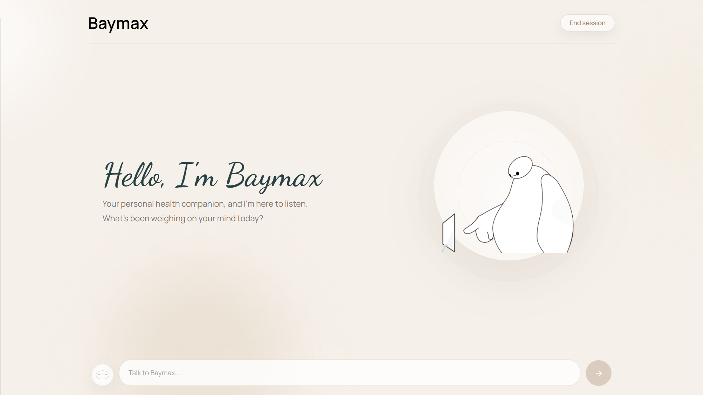

<div align="center">

# Baymax: Your Personal Healthcare Companion



A RAG-powered emotional support chatbot that reads between the lines, remembers across sessions, and responds with warmth, never scripts.

</div>

---

## What it does

Baymax is a conversational companion for emotional wellbeing. Instead of canned replies, every message goes through a reasoning pipeline that figures out what's *actually* being communicated, retrieves relevant therapeutic technique guidance, and generates a response that stays specific to the person.

- **Private reasoning pass**: before responding, an internal "scratchpad" analyses the message for emotional mechanisms, linguistic signals (deflection, hedging, sarcasm), and confidence.
- **RAG retrieval**: relevant CBT/DBT technique exemplars are pulled from a vector store to shape *how* it responds.
- **Memory**: short-term session memory plus a cross-session profile (narrative summary + emotionally significant quotes) for continuity across conversations.
- **Safety tiers**: keyword + LLM detection escalates distress (burnout → hopelessness → crisis) and weaves in appropriate support, including crisis-line resources.
- **Quality gate**: generated replies are checked against hard rules (no banned filler phrases, must engage the user's exact words) and regenerated if they fail.
- **Streaming UI**: token-by-token responses over Server-Sent Events.

## Architecture

```
User message
    │
    ▼
┌─────────────┐   ┌──────────────────┐   ┌──────────────────┐
│  Scratchpad │──▶│ Context Assembly │──▶│  RAG Retrieval   │
│ (reasoning) │   │ memory + entities│   │ (ChromaDB / MiniLM)│
└─────────────┘   └──────────────────┘   └──────────────────┘
    │                                            │
    └──────────────────┬─────────────────────────┘
                       ▼
              ┌──────────────────┐   ┌──────────────┐
              │   Generation     │──▶│ Quality Gate │──▶ Streamed reply
              │ (LLM + safety)   │◀──│  (regen)     │
              └──────────────────┘   └──────────────┘
```

- **RAG knowledge base** is built by scraping therapeutic guides and community posts, embedding them with `all-MiniLM-L6-v2`, and storing them in a persistent ChromaDB collection.

## Tech stack

| Layer    | Tools |
|----------|-------|
| Frontend | Next.js 16, React 19, Tailwind CSS 4, TypeScript |
| Backend  | FastAPI, Groq (Llama 3.3 70B), SSE streaming |
| RAG      | ChromaDB, Sentence-Transformers (`all-MiniLM-L6-v2`) |
| Memory   | SQLite (aiosqlite) |

## Quick start

**Backend**
```bash
cd backend
pip install -r requirements.txt
cp .env.example .env        # add GROQ_API_KEY (+ Reddit keys to rebuild the index)
uvicorn main:app --reload
```

**Frontend**
```bash
cd frontend
npm install
# set NEXT_PUBLIC_BACKEND_URL=http://localhost:8000 in .env.local
npm run dev
```

Open [http://localhost:3000](http://localhost:3000).

## API

| Method | Endpoint            | Purpose                                  |
|--------|---------------------|------------------------------------------|
| `POST` | `/chat`             | Streamed chat response (SSE)             |
| `POST` | `/end-session`      | Persist the session into long-term memory|
| `GET`  | `/memory/{user_id}` | Inspect a user's stored profile          |
| `GET`  | `/health`           | Health check                             |

---

> **Note:** Baymax is a supportive companion, not a substitute for professional mental health care. In a crisis, please contact a local emergency service or crisis line.
